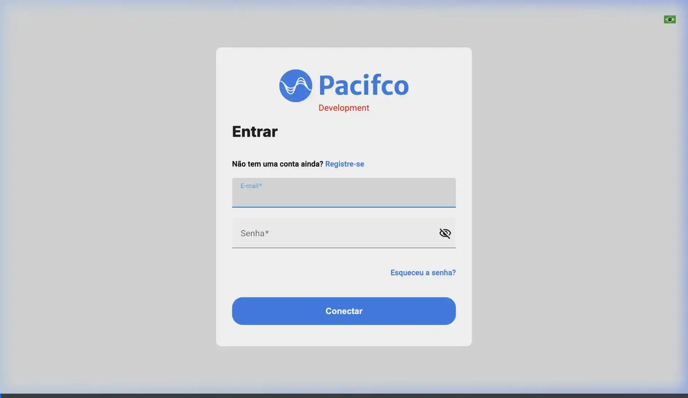
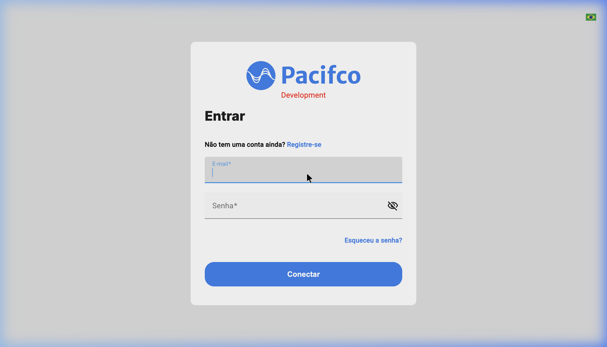
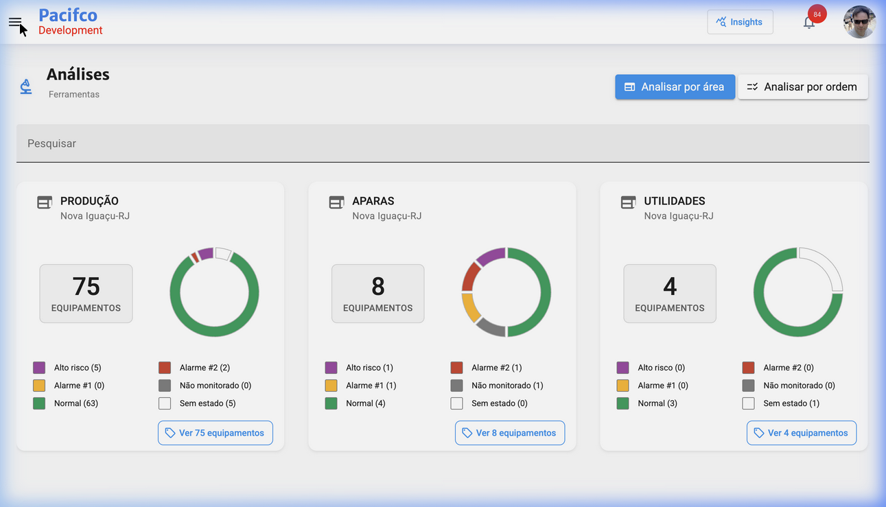
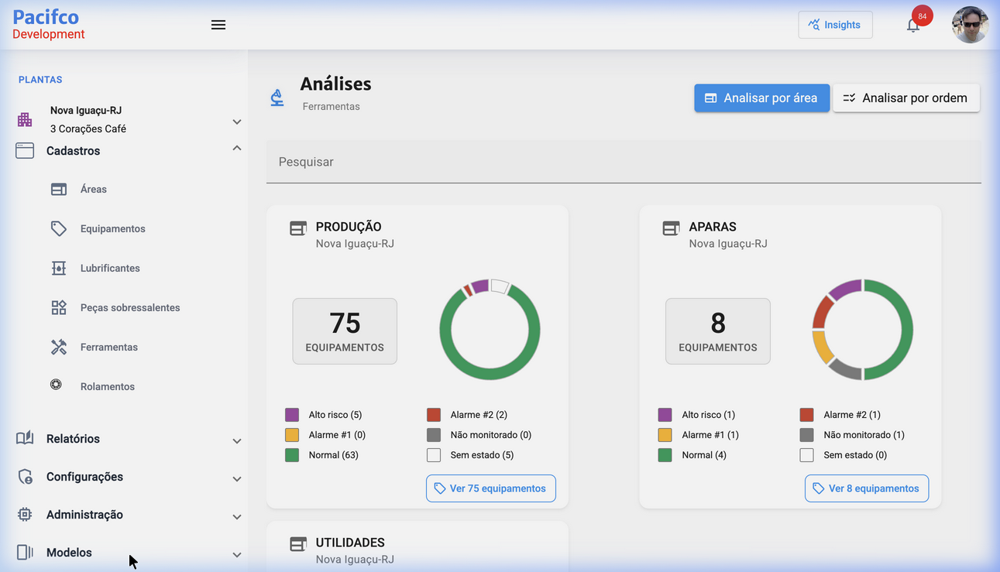
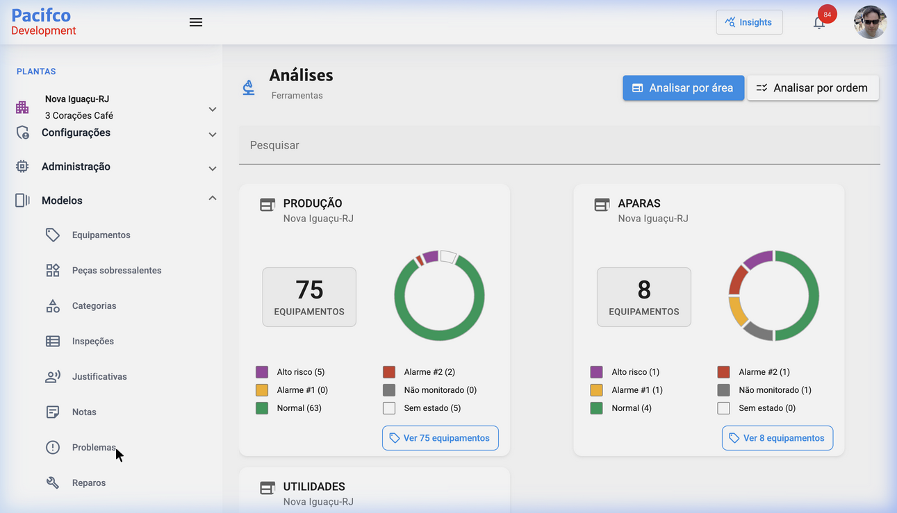
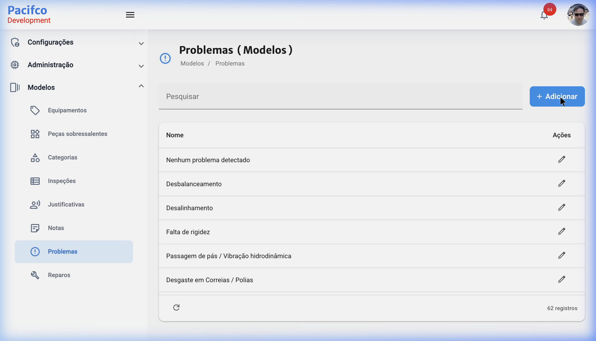
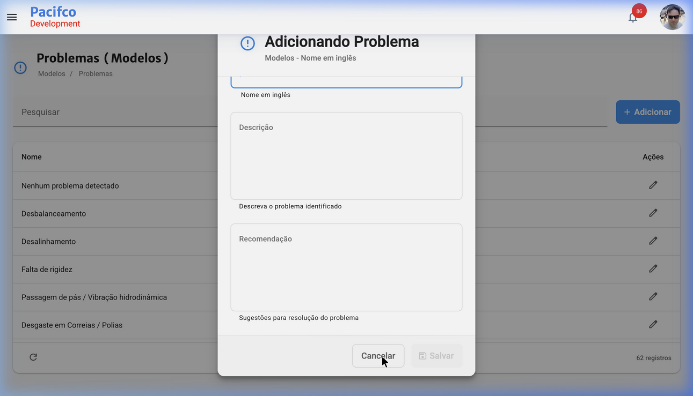

# Como Cadastrar um Problema no App4Dev Pacifco

Este documento descreve o passo a passo de como acessar o sistema e cadastrar um novo problema na seção de modelos.

## Vídeo de Demonstração
Veja o processo completo no vídeo abaixo:

---

## Passo 1: Acesso ao Sistema e Login
Acesse o portal do [App4Dev Pacifco](https://app4dev.pacifco.com/) e faça o login utilizando suas credenciais de acesso.
Clique no campo de **E-mail**, insira seu usuário, preencha a **Senha** e clique no botão de conectar.

---

## Passo 2: Navegação no Menu
Após o login, aguarde o carregamento do Dashboard.

1. Se o menu lateral esquerdo estiver recolhido, clique no botão superior (ao lado da logo) para expandir o menu.

2. No menu lateral, expanda a seção **Cadastros**, desça na barra de rolagem se necessário, e clique na opção **Modelos**.

3. Dentro do submenu de Modelos, selecione a opção **Problemas**.

---

## Passo 3: Acessando o Formulário de Inclusão
Na tela "Problemas ( Modelos )", você verá uma lista dos problemas já registrados na base. Para adicionar um novo problema, clique no botão azul **+ Adicionar** localizado no canto superior direito da tabela.

---

## Passo 4: Preenchimento do Formulário
Ao clicar em Adicionar, um formulário modal "Adicionando Problema" será aberto. 
A imagem abaixo mostra um clique no botão cancelar do formulário aberto:

O formulário deve ser preenchido com as seguintes informações:

* **Nome** *(Obrigatório)*: 
  * Insira o nome do problema. A dica de campo sugere colocar o "Nome em inglês".
* **Descrição** *(Opcional)*: 
  * Área para detalhar. Descreva aqui o problema identificado de forma clara.
* **Recomendação** *(Opcional)*: 
  * Área para detalhar. Coloque as sugestões ou instruções recomendadas para a resolução deste problema.

---

## Passo 5: Salvar
Após preencher as informações necessárias (lembre-se que o campo **Nome** deve ser obrigatoriamente preenchido para que o botão de salvar seja ativado), clique no botão **Salvar** na parte inferior da tela. Se quiser desistir do cadastro, basta clicar em **Cancelar**.
